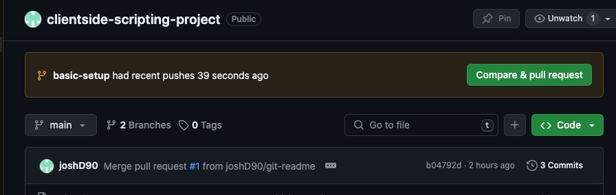
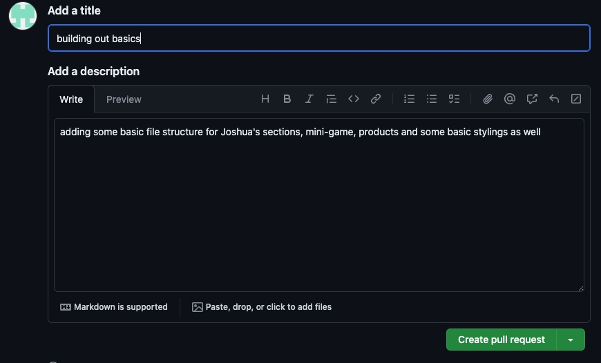
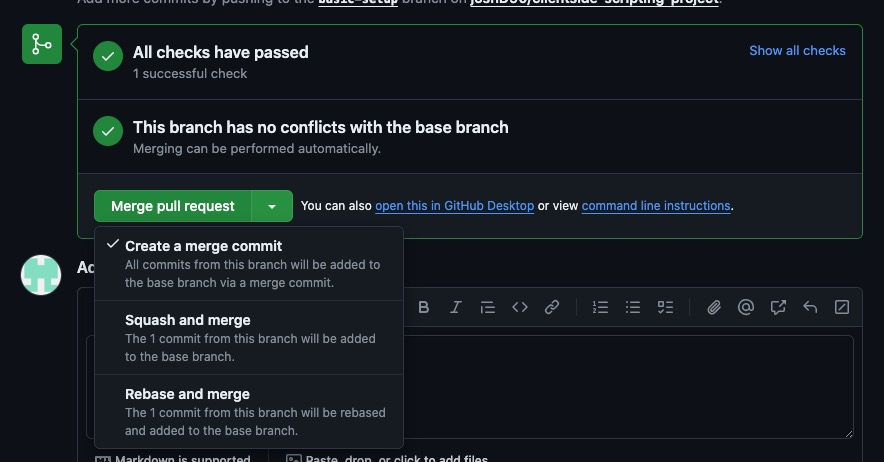
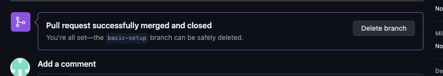

# Getting Started with Create React App

This project was bootstrapped with [Create React App](https://github.com/facebook/create-react-app).

## Available Scripts

In the project directory, you can run:

### `npm start`

Runs the app in the development mode.\
Open [http://localhost:3000](http://localhost:3000) to view it in your browser.

The page will reload when you make changes.\
You may also see any lint errors in the console.

### `npm test`

Launches the test runner in the interactive watch mode.\
See the section about [running tests](https://facebook.github.io/create-react-app/docs/running-tests) for more information.

### `npm run build`

Builds the app for production to the `build` folder.\
It correctly bundles React in production mode and optimizes the build for the best performance.

The build is minified and the filenames include the hashes.\
Your app is ready to be deployed!

See the section about [deployment](https://facebook.github.io/create-react-app/docs/deployment) for more information.

### `npm run eject`

**Note: this is a one-way operation. Once you `eject`, you can't go back!**

If you aren't satisfied with the build tool and configuration choices, you can `eject` at any time. This command will remove the single build dependency from your project.

Instead, it will copy all the configuration files and the transitive dependencies (webpack, Babel, ESLint, etc) right into your project so you have full control over them. All of the commands except `eject` will still work, but they will point to the copied scripts so you can tweak them. At this point you're on your own.

You don't have to ever use `eject`. The curated feature set is suitable for small and middle deployments, and you shouldn't feel obligated to use this feature. However we understand that this tool wouldn't be useful if you couldn't customize it when you are ready for it.

## Learn More

You can learn more in the [Create React App documentation](https://facebook.github.io/create-react-app/docs/getting-started).

To learn React, check out the [React documentation](https://reactjs.org/).

### Code Splitting

This section has moved here: [https://facebook.github.io/create-react-app/docs/code-splitting](https://facebook.github.io/create-react-app/docs/code-splitting)

### Analyzing the Bundle Size

This section has moved here: [https://facebook.github.io/create-react-app/docs/analyzing-the-bundle-size](https://facebook.github.io/create-react-app/docs/analyzing-the-bundle-size)

### Making a Progressive Web App

This section has moved here: [https://facebook.github.io/create-react-app/docs/making-a-progressive-web-app](https://facebook.github.io/create-react-app/docs/making-a-progressive-web-app)

### Advanced Configuration

This section has moved here: [https://facebook.github.io/create-react-app/docs/advanced-configuration](https://facebook.github.io/create-react-app/docs/advanced-configuration)

### Deployment

This section has moved here: [https://facebook.github.io/create-react-app/docs/deployment](https://facebook.github.io/create-react-app/docs/deployment)

### `npm run build` fails to minify

This section has moved here: [https://facebook.github.io/create-react-app/docs/troubleshooting#npm-run-build-fails-to-minify](https://facebook.github.io/create-react-app/docs/troubleshooting#npm-run-build-fails-to-minify)

# Github sharing pipeline

Open a terminal / console and 'cd' to the folder where you want the project to be held.

```
git clone https://github.com/joshd90NCI/devops-group-proj.git
```

We need to create a new branch for every feature that we create. (plug in your own branch name instead of <new-branch-name>)

```
git pull origin main
git checkout -b <new-branch-name>
```

Make the changes and commit them to this branch

```
git add .
git commit -m "Commit with a descriptive message of what you have changed"
```

Push the branch to the remote repository on Github

```
git push origin
```

Now we want to push these to Github from our local environment.

```
git push origin <branch-name>
```

Now the changes have been pushed to the remote repository under that branch name.

## Opening a pull request

Go to the repository on GitHub.com and click the "Compare & pull request" button for your branch.
<br/>
<br/>



<br/>

Fill in the PR template, providing a summary of your changes and any other relevant information for reviewers.
<br/>
<br/>



<br/>
This will notify everyone else on the team so that they can look at it and approve it.

## Approving a pull request

- Approve the PR request if you are happy and there are no conflicts.
- Choose "Squash and Merge". This will consolidate all the commits of the PR request into one
  <br/>
  <br/>
  <br/>
  
  <br/>
- Confirm the submission
  <br/>
  <br/>
  <br/>
  
  <br/>
- delete the branch
  <br/>
  <br/>
  <br/>
  
  <br/>

## Update Your own Repository

Go back to your own local repository / folder on your computer
Make sure you are on main branch and then pull from the remote repository

```
git checkout main
git pull origin main
```

# Dealing with Merge Conflicts

Dealing with merge conflicts can seem daunting at first, but it becomes straightforward once you get the hang of it. Here's a simplified step-by-step guide to resolving conflicts by pulling changes to your local repository:

## 1. Ensure Your Branch is Up-to-Date

Before you start resolving conflicts, make sure your local branch is up-to-date with the main branch. This step can help minimize the number of conflicts.

- Switch to your main branch:

```
git checkout main
```

- Pull the latest changes from the remote repository:

```
git pull origin main
```

## 2. Switch to Your Feature Branch

- Go back to the branch where you're working on your feature or the changes that caused the conflict.

```
git checkout your-branch-name
```

## 3. Merge the Main Branch into Your Branch

- Merge the latest changes from the main branch into your feature branch. This step might trigger the conflicts.

```
git merge main
```

- If there are conflicts, Git will stop the merge and tell you which files need attention.

## 4. Resolve the Conflicts

- Open the conflicting files in your code editor. Git marks the conflicts in the file so you can see the differences.
- You'll see sections marked with `<<<<<<<`, `=======`, and `>>>>>>>`. These markers define the conflicting changes from both branches.
- Decide which changes to keep, edit the file to resolve the conflicts, and remove the Git markers.

## 5. Mark Conflicts as Resolved

- After you've resolved the conflicts in a file, you need to add the file to the staging area to indicate that the conflict is resolved:

```
git add filename
```

## 6. Complete the Merge

- Once all conflicts are resolved and the files are added, you can complete the merge process:

```
git commit
```

- Git will open your default text editor to allow you to edit the commit message for the merge. You can simply save and close the editor to accept the default message.

## 7. Push Your Changes

- Push your resolved changes back to the remote repository:

```
git push origin your-branch-name
```

## 8. Create a new pull request for the resolved merges

Go back onto Github and click on create new pull request and process repeats again
